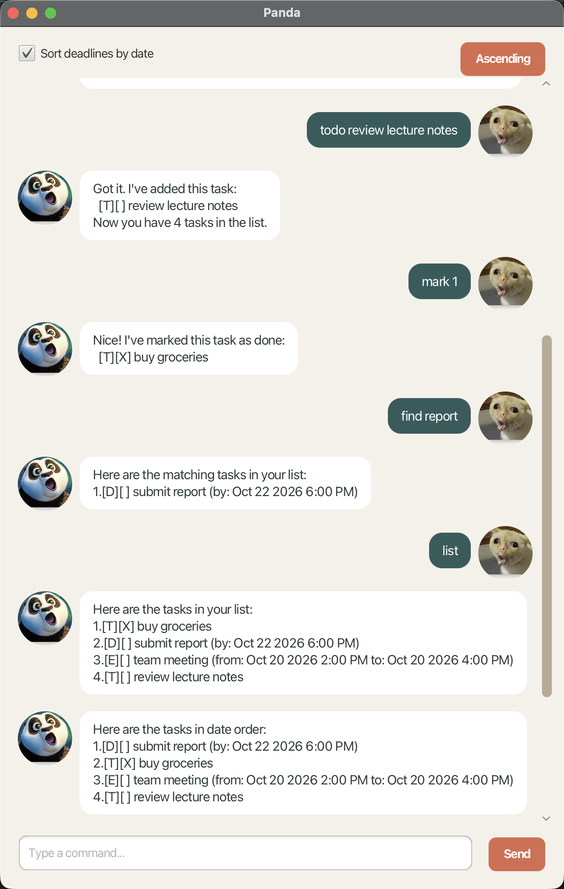

# Panda User Guide

**Panda** is a desktop chatbot that keeps your todos, deadlines, and events in one simple task list.
Type a command in the chat box and press <kbd>Enter</kbd> or click **Send**.



## Quick start

Try these commands one at a time:

```text
todo buy groceries
deadline submit report /by 2026-10-22 1800
event team meeting /from 2026-10-20 1400 /to 2026-10-20 1600
list
```

Panda saves changes automatically, so your tasks are available when you reopen the app.

## Command format

- Type each command on one line, with exactly one space between words.
- `DESCRIPTION`, `KEYWORD`, and `INDEX` below are values you replace with your own.
- Task indexes start at `1` and refer to the list currently on screen.
- Use dates such as `2026-10-22` or `22/10/2026`.
- Add a time with `1800`, `18:00`, or `6:00 PM`. A date without a time means midnight.

## Features

### Add a todo: `todo`

Format: `todo DESCRIPTION`

Example: `todo buy groceries`

### Add a deadline: `deadline`

Format: `deadline DESCRIPTION /by DATE [TIME]`

Example: `deadline submit report /by 2026-10-22 1800`

### Add an event: `event`

Format: `event DESCRIPTION /from DATE [TIME] /to DATE [TIME]`

The end date/time must be later than the start date/time.

Example: `event team meeting /from 2026-10-20 1400 /to 2026-10-20 1600`

### View all tasks: `list`

Format: `list`

### Find tasks: `find`

Format: `find KEYWORD`

Panda searches task descriptions without considering letter case.

Example: `find report`

### Mark a task as done: `mark`

Format: `mark INDEX`

Example: `mark 2`

### Mark a task as not done: `unmark`

Format: `unmark INDEX`

Example: `unmark 2`

### Delete a task: `delete`

Format: `delete INDEX`

Example: `delete 3`

### Exit Panda: `bye`

Format: `bye`

## Sort deadlines by date

Select **Sort deadlines by date** above the chat history to order deadlines by their `/by` date and time.
Use the **Ascending**/**Descending** button to choose earliest-first or latest-first order.

Only deadlines are sorted. Todos and events follow them in the order they were added; events are not
sorted by their `/from` time. While sorting is on, `mark`, `unmark`, and `delete` use the numbers shown
in that sorted view. Unselect the checkbox to restore the original order.

## Saving and errors

Panda stores tasks automatically in `data/panda.txt`; there is no save command. Avoid editing that file
directly. If a command is incomplete or invalid, Panda explains the problem and keeps your existing tasks
unchanged. Identical tasks are not added twice.

## Command summary

Command | Format | Example
--- | --- | ---
Todo | `todo DESCRIPTION` | `todo buy groceries`
Deadline | `deadline DESCRIPTION /by DATE [TIME]` | `deadline report /by 2026-10-22 1800`
Event | `event DESCRIPTION /from DATE [TIME] /to DATE [TIME]` | `event meeting /from 2026-10-20 1400 /to 2026-10-20 1600`
List | `list` | `list`
Find | `find KEYWORD` | `find report`
Mark | `mark INDEX` | `mark 2`
Unmark | `unmark INDEX` | `unmark 2`
Delete | `delete INDEX` | `delete 3`
Exit | `bye` | `bye`
